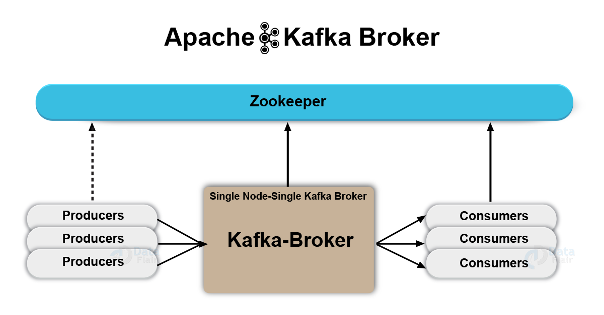
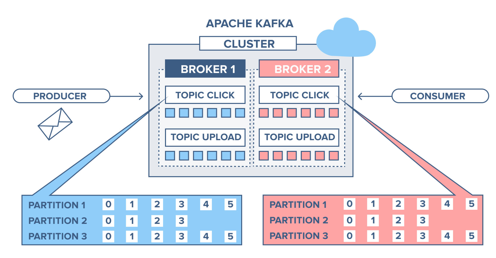
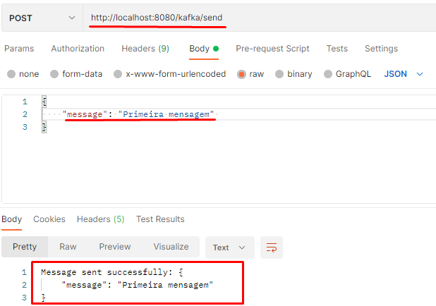
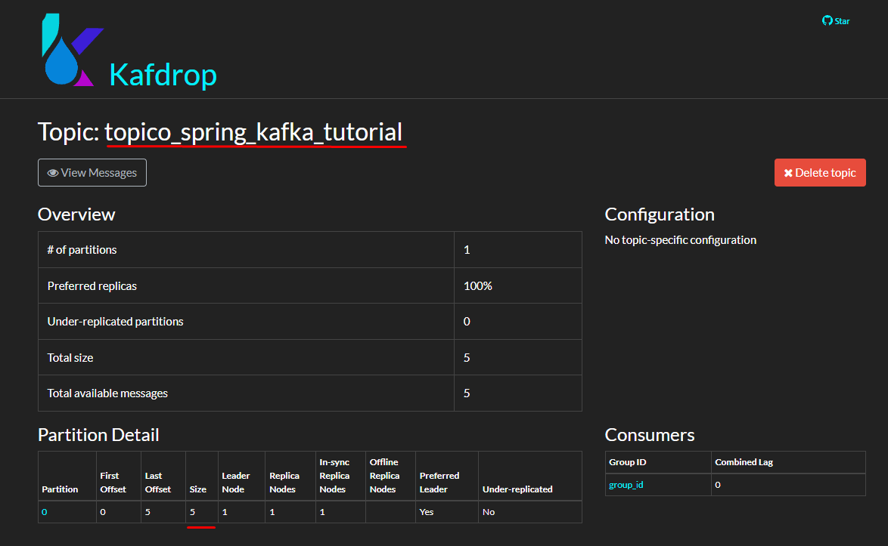
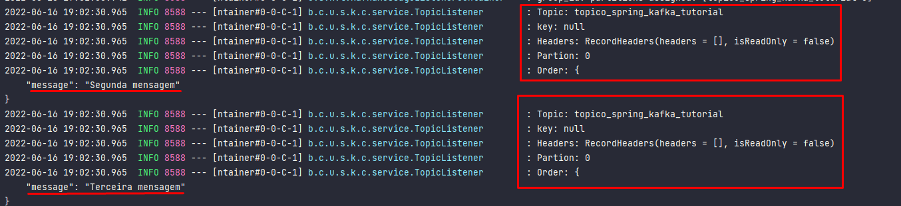

# Apache Kafka

- [Requisitos](#requisitos)
- [Objetivo](#objetivo)
- [O que é Apache kafka?](#O-que-é-apache-kafka-)
  - [Broker e Cluster](#broker-e-cluster)
  - [Mensagens](#mensagens)
    - [Tópicos](#tópicos)
    - [Partições](#partições)
    - [Producer](#producer)
    - [Consumer](#consumer)
  - [Hands On](#hands-on)
    - [Iniciando os serviços](#iniciando-os-serviços)
    - [Criando um Tópico](#criando-um-tópico)
    - [Produzindo algumas mensagens](#produzindo-algumas-mensagens)
    - [Lendo algumas mensagens](#lendo-algumas-mensagens)
    - [Brincando um pouquinho com o Kafka](#brincando-um-pouquinho-com-o-Kafka)
- [Integrando Kafka com SpringBoot](#integrando-kafka-com-springboot)
  - [Como Utilizar kafka no SpringBoot](#como-utilizar-kafka-no-springBoot)
  - [Criando as classes do microserviço Producer](#criando-as-classes-do-microserviço-producer)
    - [TopicProducer](#TopicProducer)
    - [MessageControler](#MessageControler)
    - [ Enviando algumas mensagens pelo microserviço](#enviando-algumas-mensagens-pelo-microserviço)
  - [Criando as classes do microserviço Consumer](#criando-as-classes-do-microserviço-consumer) 
    - [TopicListener](#TopicListener)
    - [Lendo as mensagens pelo microserviço consumer](#lendo-as-mensagens-pelo-microserviço-consumer)
- [Conclusão](#conclusão) 

# Requisitos
- Docker instalado na máquina (Veja como fazer o download: https://docs.docker.com/get-docker/)
- Java 11 (Veja como fazer download: [java11](https://www.oracle.com/br/java/technologies/javase/jdk11-archive-downloads.html))
- Gerenciador de depedência Maven

# Objetivo
  O objetivo deste tutorial é trazer conceitos importantes acerca de kafka, e uma demonstração simples da sua utilização.

# O que é Apache kafka?
  O Apache Kafka é uma plataforma de software de código fonte aberto para processamento de fluxo de mensagens escrita em Scala com Java. Kafka foi criado como uma solução interna de infra-estrutura na LinkedIn para lidar com os dados como um fluxo contínuo e crescente de informação para aplicações.

  Um cluster Kafka é não só altamente escalável e tolerante a falhas, mas ele também tem uma taxa de transferência muito mais alta comparada com outros message brokers. O Kafka funciona como um **cluster de brokers** e isso permite configurações interessantes de disponibilidade, o que atrai a grandes empresas com sistemas críticos.
  
  O Zookeeper é um serviço centralizado para, entre outras coisas, coordenação de sistemas distribuídos. O Kafka é um sistema distribuído, e consequentemente delega diversas funções de gerenciamento e coordenação para o Zookeeper. Segundo a Confluent(empresa  responsável por aprimorar e adicionar recursos ao Kafka)
  afirma que dentro algumas releases, a dependência do kafka com zookeeper será completamente removida
## Broker e Cluster
  O conceito de broker na plataforma do Kafka é nada mais do que praticamente o proprio Kafka, ele é quem gerencia os tópicos, define a forma de armazenamento das mensagens, logs etc.

  O conceito de cluster é nada mais do que um conjunto de Brokers que se comunicam entre si ou não para uma melhor escalabilidade e tolerância a falhas.
  
## Mensagens
  Entenda por mensagens toda a informação que trafega sobre o Apache Kafka, seja uma frase, uma palavra, um array de bytes etc..
### Tópicos
  Um tópico é uma forma de rotular ou categorizar uma mensagem, imagine um armário com 10 gavetas, cada gaveta pode ser um tópico e o armário é a plataforma Apache Kafka, portanto alem de categorizar ele agrupa as mensagens
### Partições
  As partições é a camada de partição das mensagens dentro de um tópico, este particionamento garante a elasticidade, tolerância a falha e escalabilidade do Apache Kafka, portanto cada tópico pode ter varias partições em diferentes localidades.
### Producer
  O Kafka utiliza o conceito de produtores e consumidores para definir os clientes que se conectam ao broker. Produtores criam as mensagens para um tópico específico, isso não é regra e sim o comportamento mais comum. O produtor no geral não se preocupa em qual partição a mensagem será salva e faz o balanceamento entre todas as disponíveis.
### Consumer
  Consumidores leem as mensagens produzidas e controlam o consumo através dos offsets das mensagens. O offset da última mensagem é armazenado e com isso o consumidor pode parar e iniciar sem perder o histórico.



# Hands on
### Iniciando os serviços
 Para iniciar o nosso tutorial prático, utilizaremos Docker.
 
 Primeiro iremos iniciar nossos containers,zookeeper, borker kafka e kafdrop(ferramenta que irá fornecer uma UI amigável para realizarmos nossos testes)
 Faça download da imagem do Redis:
```bash
$ docker-compose up -d
```
  Com o comando ```docker network ls ``` podemos confirmar que a rede  kafka-tutorial_broker-kafka foi criada com sucesso.
  Já o comando ```docker-compose ps``` mostrará que os containers dos serviços subiram.
  Lembrando que para acessar a Ui do kafkdrop acesse o <http://localhost:19000> .
### Criando um Tópico
  Vamos começar a usando command line do kafka, como o comando a seguir sugere criaremos um topico com nome de "my_first_topic"
 ```bash
$ docker exec broker \
kafka-topics --bootstrap-server broker:9092 \
             --create \
             --topic my_first_topic
 ```
### Produzindo algumas mensagens
  Nós podemos usar o command line do kafka-console-producer para gerar mensagens em um tópico. Isso é útil para esse tutorial, mas na prática usaremos a API do Producer no código do aplicativo ou o Kafka Connect para extrair dados de outros sistemas para o Kafka.
```bash
$ docker exec --interactive --tty broker \
kafka-console-producer --bootstrap-server broker:9092 \
                       --topic my_first_topic
 ```

### Lendo algumas mensagens
  Agora que escrevemos a mensagem para o tópico, vamos ler essas mensagens de volta. Execute este comando para iniciar o kafka-console-consumer. **O ```--from-beginning``` é um argumento para que as mensagens sejam lidas desde o início do tópico.
  ```bash
$ docker exec --interactive --tty broker \
kafka-console-consumer --bootstrap-server broker:9092 \
                       --topic my_first_topic \
                       --from-beginning
 ```
### Brincando um pouquinho com o Kafka
  Agora iremos explorar um pouquinho mais a teoria explicada acima.
  Primeiro criaremos um outro tópico com 3 partições.
 ```bash
$ docker exec broker \
kafka-topics --bootstrap-server broker:9092 \
             --create \
             --partitions 3 \
             --replication-factor 1 \
             --topic new_topic
 ```
  Em seguida, abra outro terminal e criaremos um consumidor e o colocaremos em um consumer group
  ```bash
$ docker exec broker \
kafka-console-consumer --bootstrap-server broker:9092 \
             --topic new_topic \
             --group microservice-1
 ``` 
 Replique essa etapa para outros dois terminais.
 Após isso comece a produzir mensagens para este topico
 ```bash
$ docker exec --interactive --tty broker \
kafka-console-producer --bootstrap-server broker:9092 \
                       --topic new_topic
 ```
 Iremos perceber que cada membro do consumer group está lendo de uma partição específica. Podemos ir além e subir um 4º membro para esse grupo e perceberemos também que ele ficará ocioso, pois cada membro só pode ler uma partição do tópico.

# Integrando Kafka com SpringBoot
 Nessa parte do tutorial iremos utilizar o kafka juntamente com **SpringBoot**. Para isso foram construídos dois microserviços, um producer e um consumer.
 ### Como Utilizar kafka no SpringBoot
 No arquivo ```pom.xml```, é possível integrar com o Kafka através de bibliotecas criadas para o ecossistema Spring Boot:
 ```
 <dependency>
	<groupId>org.springframework.kafka</groupId>
    <artifactId>spring-kafka</artifactId>
 </dependency>
 ```
 ### Criando as classes do microserviço Producer
 Para esse tutorial, iremos exemplificar com um endpoint que será responsável por enviar mensangens para um tópico.
 Nossa estrutura de classes ficará:
```
├── controller
│   └── MessageControler.java
├── service
│   └── TopicProducer.java
├── ProducerApplication.java
```
- A classe `MessageControler` ficará responsável por expor um endpoint.
- A classe `TopicProducer` é a classe que faz a configuração de como a mensagem será enviada para o tópico.
- A classe `ProducerApplication` é a classe principal que executará o framework.
### TopicProducer
```java
@Service
@RequiredArgsConstructor
public class TopicProducer {

    private static final Logger logger = LoggerFactory.getLogger(TopicProducer.class);

    @Value("${topic.name.producer}")
    private String topicName;

    private final KafkaTemplate<String, String> kafkaTemplate;

    public void send(String message) {
        logger.info("Payload enviado: {}", message);
        kafkaTemplate.send(topicName, message);
    }
}
```
KafkaTemplate é a classe que faz o envio de mensagens para os tópicos, o primeiro String é o tópico e o segundo o tipo de informação.

 ### MessageControler
```java
@RequiredArgsConstructor
@RestController
@RequestMapping("/kafka")
public class MessageControler {
  private final TopicProducer topicProducer;
  @PostMapping("/send")
  public ResponseEntity<String> send(@RequestBody String message){

    topicProducer.send(message);
    return ResponseEntity.ok().body("Message sent successfully: " + message);
  }
}
```
 ### Enviando algumas mensagens pelo microserviço
 Para produzir algumas mensagens iremos utilizar o Postman: \
 
 Após criarmos produzirmos algumas mensagens podemos observar no **Kafdrop**: \
  \
 ### Criando as classes do microserviço Consumer
 No consumer, iremos exemplificar subindo um microserviço para consumir as mensagens.
 Nossa estrutura de classes ficará:
```
├── service
│   └── TopicListener.java
├── ProducerApplication.java
```
### TopicListener
```java
@Service
@RequiredArgsConstructor
public class TopicListener {

    private static final Logger logger = LoggerFactory.getLogger(TopicListener.class);

    @Value("${topic.name.consumer}")
    private String topicName;

    @KafkaListener(topics = "${topic.name.consumer}", groupId = "group_id")
    public void consume(ConsumerRecord<String, String> payload){
        logger.info("Topic: {}", topicName);
        logger.info("key: {}", payload.key());
        logger.info("Headers: {}", payload.headers());
        logger.info("Partion: {}", payload.partition());
        logger.info("Order: {}", payload.value());
    }
}
```
 Está bem simples, a anotação ```“@KafkaListener”``` permite conexão com um tópico para o recebimento de mensagens.
 ### Lendo as mensagens pelo microserviço consumer
 

# Conclusão
Depois de tudo que foi dito concluimos que o **Kafka** é um sistema de mensageria que traz a proposta de unir o melhor dos modelos tradicionais de fila e publish-subscribe, permitindo a escalabilidade do processamento de mensagens do primeiro e a distribuição em massa das mensagens do segundo.
Vale ressaltar que o kafka é uma ferramenta muito poderosa e não é indicado para aplicações simples, pois existe uma curva de aprendizado considerável e uma complexidade nas configurações.
